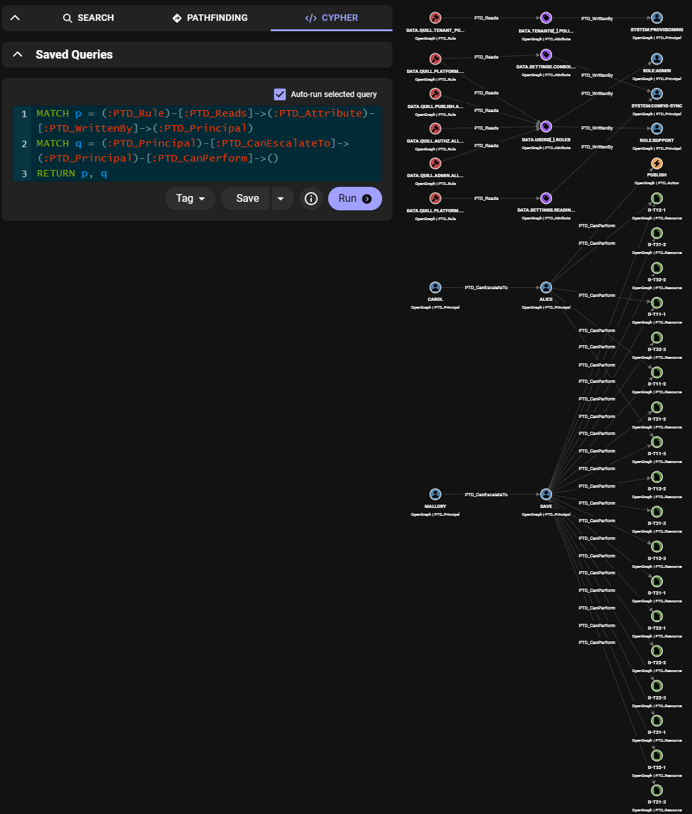
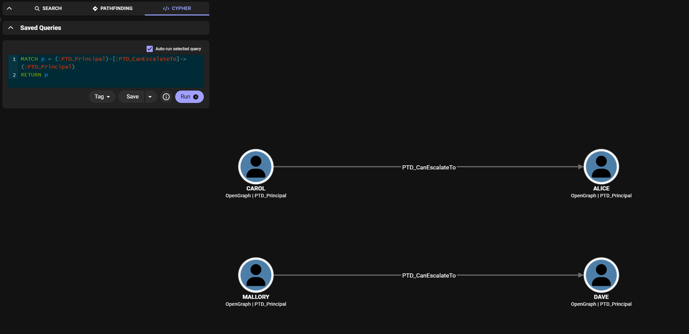
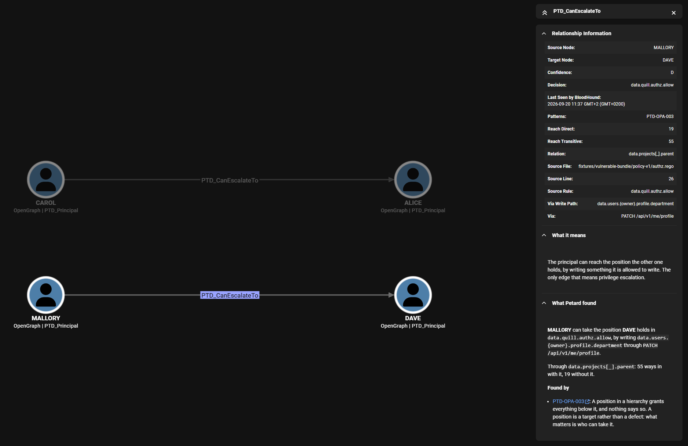
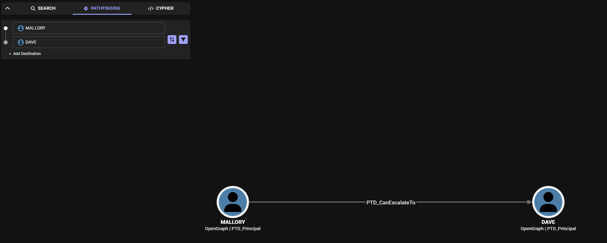
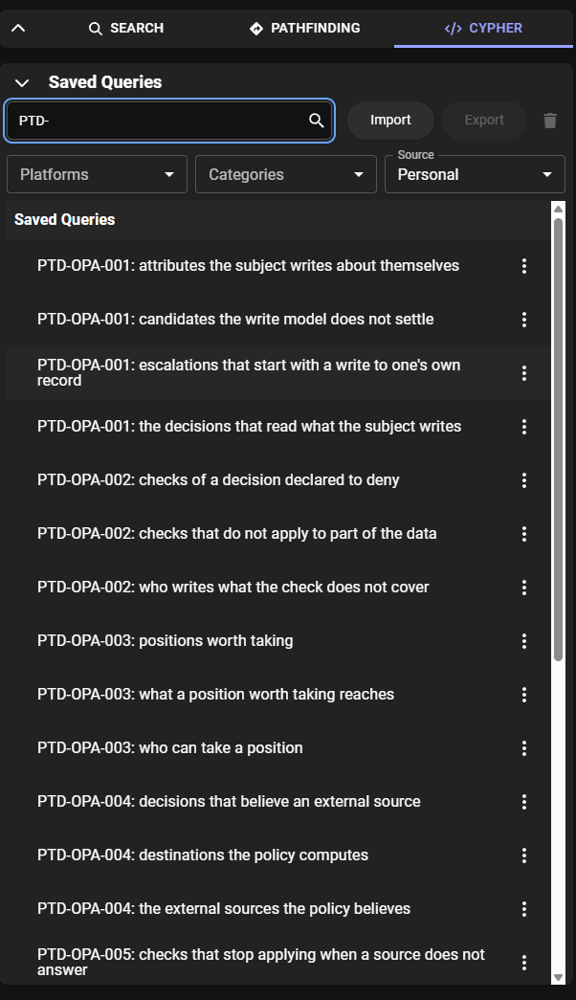
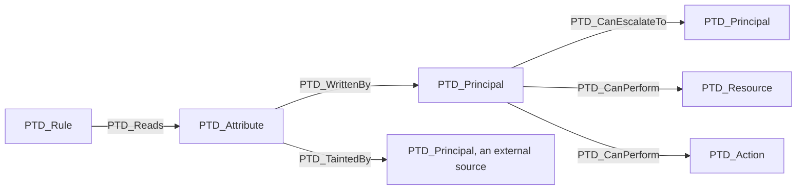

# Petard

[](https://github.com/saluc28/petard/actions/workflows/test.yml)
[](https://github.com/saluc28/petard/actions/workflows/lint.yml)
[](https://github.com/saluc28/petard/actions/workflows/security.yml)
[](https://pkg.go.dev/github.com/saluc28/petard)

Attack-path analysis for policy-as-code. Petard reads Rego (OPA) policies, works out what their
decisions depend on, and applies a curated taxonomy of privilege-escalation patterns to what it
finds. The result leaves the tool as a structured BloodHound OpenGraph, where the escalations it
found are edges the interface can walk.

A linter sees one file. Petard is built to see the policy, the data it reads and who can write
that data, together, because that is where the interesting failures live: the ones that cross
the line between whoever takes a decision and whoever writes what the decision is taken on.



## What it finds

Eight patterns live in [`taxonomy-registry/`](taxonomy-registry), which is versioned data rather
than code. Every one of them runs against the fixture in this repository, and the registry is the
source of truth down to what each has been held to. These are one-line glosses; `petard patterns`
lists them from the binary and `petard explain <id>` prints one in full.

| ID | What it looks for |
|---|---|
| `PTD-OPA-001` | the subject writes an attribute the policy reads to decide about them |
| `PTD-OPA-002` | a deny rule is silent for part of the data, so the check does not apply there |
| `PTD-OPA-003` | a position in a hierarchy grants everything below it, and nothing says so |
| `PTD-OPA-004` | a decision depends on an external source, so whoever controls it decides |
| `PTD-OPA-005` | a check that needs an external source stops applying when it does not answer |
| `PTD-OPA-006` | one decision lets a principal write the data another decision grants on |
| `PTD-OPA-007` | a check written with `every` stops applying when its collection is empty |
| `PTD-OPA-008` | a document every request shares decides for anybody who asks |

Two of them end in the words privilege escalation, and each draws a `PTD_CanEscalateTo` edge
between two principals: `PTD-OPA-001` and `PTD-OPA-003` chain into one, `PTD-OPA-006` draws the
other. Neither names a value it made up. The engine leaves the document unknown and asks OPA
what is left of the decision, so "some value here works" is an answer from the policy rather
than a guess about it. [docs/taxonomy.md](docs/taxonomy.md) walks both chains.

## Install

One file, no runtime:

```
# Linux, x86_64
curl -L -o petard https://github.com/saluc28/petard/releases/latest/download/petard_Linux_x86_64
chmod +x ./petard

# macOS, Apple silicon
curl -L -o petard https://github.com/saluc28/petard/releases/latest/download/petard_Darwin_arm64
chmod +x ./petard
```

On Windows:

```
Invoke-WebRequest -Uri "https://github.com/saluc28/petard/releases/latest/download/petard_Windows_x86_64.exe" -OutFile "petard.exe"
```

In a pipeline, `ghcr.io/saluc28/petard:latest`, or pin the version. From source, with Go 1.26 or
newer, `go install github.com/saluc28/petard/cmd/petard@latest`.

`petard version` says which build it is and which OPA is compiled into it, which is what an
analysis depends on.

## Quickstart

Analyzing a policy never calls the endpoints written in it.

```
petard demo
```

`demo` analyzes a policy with escalation built into it on purpose, written by hand and carried
inside the binary, so there is something to look at before you point the tool at your own
policies. It leads with who can take whose place:

```
8 files, 13 decisions, parsed as rego v1

Escalations
  mallory -> dave  (PTD-OPA-003, confidence D)
    writes     data.users.{owner}.profile.department
    through    PATCH /api/v1/me/profile
    in         data.quill.authz.allow

  carol -> alice  (PTD-OPA-006, confidence D)
    writes     editor into data.users.{owner}.roles
    through    PUT /api/v1/users/{id}/roles
    allowed by data.quill.admin.allow
    in         data.quill.publish.allow

Findings
    1  PTD-OPA-001  The subject writes an attribute the policy reads to decide about them
    1  PTD-OPA-002  A deny rule is silent for part of the data, so the check does not apply there
    1  PTD-OPA-003  A position in a hierarchy grants everything below it, and nothing says so
    5  PTD-OPA-004  A decision depends on an external source, so whoever controls it decides
    2  PTD-OPA-005  A check that needs an external source stops applying when it does not answer
    1  PTD-OPA-006  One decision lets a principal write the data another decision grants on
    1  PTD-OPA-007  A check written with every stops applying when its domain is empty
    1  PTD-OPA-008  A document every request shares decides for anybody who asks

Candidates, which need a write model to become findings
    1  PTD-OPA-003  A position in a hierarchy grants everything below it, and nothing says so

How much to trust this
  Level D (field names): the subject is input.user. 17 reads over 11 data paths.
  The write model covers 6 of 11 paths read (54%).
```

`-v` adds the evidence under it: every read with its file and line, what each decision is left
to check once the data is concrete, and every place to go and look.

The patterns travel in the binary, so the two commands that read them work without a checkout:

```
petard patterns
petard explain PTD-OPA-006
```

`explain` prints what the pattern looks for signal by signal, what has to be true for a match to
be a defect, the conditions it fires on with nothing behind them, and where the file is.

To send an analysis to BloodHound CE, write the bundle to disk and export it. The credentials
come from two environment variables, because a token on a command line ends up in the shell
history:

```
petard demo -extract .
export BLOODHOUND_TOKEN_ID=...
export BLOODHOUND_TOKEN_KEY=...
petard export -url https://bloodhound.example -install -upload -verify \
  -write-model vulnerable-bundle/write-model.yaml \
  -data vulnerable-bundle/data vulnerable-bundle/policy-v1
```

```
graph: 62 nodes, 84 edges
schema installed, 3 of 5 relationship kinds are traversable
saved queries: 29 added, 0 already there
ingest job 3 started
job 3 processed 1 file(s) with no errors
  MALLORY -> DAVE: pathfinding walks it
  CAROL -> ALICE: pathfinding walks it
2 of 2 escalations are walkable in BloodHound
```

`-verify` asks the server for a path between the two principals of every escalation in the
payload, with `only_traversable`, and fails if it will not walk one. A graph that claims a path
nobody can take is the single thing this tool must not produce.

Without an instance, `-out graph.json` writes the payload, and BloodHound takes a JSON upload
from the interface.

## Reading it in BloodHound

The escalations are edges, so they show up the way any other attack path does.



Select one and the Entity Panel says what was found on that edge: who takes whose position, in
which decision, by writing what and through which endpoint, how many ways in the relation adds,
at which level the request was recognized, and a link to the file of the pattern that reported
it.



Pathfinding walks them too, which is what `-verify` checks over the API.



Installing also saves 29 Cypher queries, two to four per pattern, named after the question they
ask. They return nodes and paths, so the answer opens in the graph and in the table view next to
it.



## The model

Five node kinds and five relationship kinds, declared in `internal/graph` and exported through
[bhgraph](https://github.com/saluc28/bhgraph).



`PTD_CanPerform`, `PTD_WrittenBy` and `PTD_CanEscalateTo` are the three BloodHound may walk.
`PTD_Reads` and `PTD_TaintedBy` are dependencies rather than capabilities, and marking them
traversable would invent paths in the interface that nobody can take. The decision is made in
the model and the schema is generated from it, so the two cannot drift apart.

The kind names and the property keys are a contract before they are code. They end up in
ingested data and in saved queries, so renaming one means re-ingesting every graph and
rewriting every query that mentions it.

## Running it on your own policy

The decisions are the starting points. A policy that annotates its entrypoints needs nothing;
one that does not has to be told, because the alternative is guessing which rule the enforcement
point queries:

```
petard analyze -entrypoint authz/allow path/to/policy
```

An enforcement point that refuses the request as soon as a rule returns anything, the way
Gatekeeper reads `violation`, declares that side instead. Which side a read is on is then
counted from the refusal:

```
petard analyze -deny-entrypoint k8sallowedrepos/violation path/to/policy
```

A decision can also be one field of what a rule returns, and the part of the request that names
the requester can be declared rather than recognized:

```
petard analyze -entrypoint aac/aap/policy/owner_scope/allowed \
  -subject input.created_by.username -data path/to/config path/to/policy
```

Two inputs decide how much of an answer you get. Concrete data under `-data` is what turns a
pattern into a finding about named principals, since the engine evaluates each decision
partially against it. The write model under `-write-model` says who can write which path, which
the policy never says, and without it every match stays a candidate. The run reports how many of
the paths the decisions read the model covers, so an empty model is distinguishable from a clean
result.

## In a pipeline

```
petard analyze -quiet -fail-on findings -write-model write-model.yaml -data data policy
```

| Exit | What it means |
| ---- | ------------- |
| 0 | nothing above the threshold |
| 1 | the analysis could not run |
| 2 | the command line was wrong |
| 3 | matches above the threshold |

`-fail-on findings` is the default and counts findings; `any` counts candidates as well, and
`none` reports and exits 0 whatever it finds. Exit 3 means the analysis ran and found something,
exit 1 means it could not run, and a pipeline needs to tell those apart.

`-quiet` prints the escalations and the findings and nothing around them, and prints nothing at
all when there are none. The report goes to stdout and everything else to stderr, and two runs
of the same bundle print the same bytes. Escape sequences are used only when the output is a
terminal that takes them; `NO_COLOR` and `-no-color` turn them off.

## What it does not do

It does not decide whether a finding is a problem in your system. A position in a hierarchy is a
target rather than a defect, and the report says who can take it and leaves the judgment to you.

It reports at the level the request was recognized at, from a declaration down to a guess about
field names, and the level travels with every claim that rests on it. An edge measured at level
D is a hypothesis about which field names the requester, and reads differently from one measured
against a declaration.

Some shapes of negation are still invisible to the walk. `count(S) == 0` over a comprehension
written inline reads as an ordinary comparison, and `not count(S) > 0` is not read as "empty". An
`and` or an `or` written inside a comprehension, an `every` or a `not` is read like any other
expression, but partial evaluation answers for it with the documents it reads rather than with
the requests that make it hold.

A function that takes the requester inside an array, as `f([user, project])` does, is not
followed into that argument, so a lookup by value made there is not seen.

## Layout

```
cmd/petard            the binary, which dispatches to the subcommands
internal/cli          one package per subcommand, plus render for the printing rules
internal/opaengine    everything that knows what Rego is
internal/graph        the engine-neutral model, all a second engine has to fill
internal/opengraph    the adapter to what BloodHound ingests, over bhgraph
internal/taxonomy     the registry reader and the patterns
internal/writemodel   who can write which path, declared rather than inferred
internal/fixture      generated worlds, and the truth about them
queries/              the saved Cypher queries, one file each
taxonomy-registry/    the patterns as versioned data, embedded for explain and patterns
schema/               the extension definition schema, generated from the model
fixtures/             the bundle written by hand, in Rego v1 and v0, embedded for demo
```

## Documentation

- [docs/engine.md](docs/engine.md): how a bundle is read, what the analysis reports, and how
  each claim is checked
- [docs/taxonomy.md](docs/taxonomy.md): the two escalation chains, and what the write model
  holds up
- [taxonomy-registry/README.md](taxonomy-registry/README.md): the format of a pattern file and
  what `verified` means
- [queries/README.md](queries/README.md): the saved queries, and what the BloodHound backend
  will and will not run
- [CHANGELOG.md](CHANGELOG.md): what changed between versions

## License

Apache-2.0. See [LICENSE](LICENSE).
